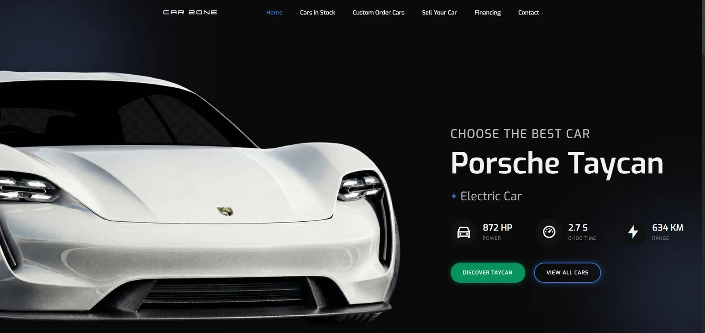

# Car Zone

An independent automotive marketplace concept — a multi-page front end for vehicle inventory discovery, detailed vehicle presentation, and enquiry flows.



## Live demo

https://car-zone-five.vercel.app/

## Case study

https://lumax.agency/work/car-zone/

## Status

Independent portfolio project. The vehicle catalogue, prices, contact information, and business claims are demonstration content and should not be interpreted as a live dealership offer.

## Overview

Car Zone imagines what a modern performance-car dealership site could look like: a Porsche Taycan-led homepage, a large filterable inventory spanning dozens of brands, and a dedicated deep-dive page for a flagship listing (Mercedes-Benz S580). The front end is fully static — semantic HTML per page and SCSS compiled to plain CSS, with no build step required to run it.

Beyond the visual layer, the project carries complete interaction flows: a financing calculator computes monthly payments and total interest client-side, inventory can be filtered without a framework, and three enquiry experiences demonstrate validation in an explicit local demo mode. The forms do not transmit or persist personal data.

## Pages

- `index.html` — Taycan-led homepage
- `stoc.html` — filterable vehicle inventory
- `s580.html` — detailed Mercedes-Benz S580 presentation
- `comanda.html` — custom vehicle request
- `vinde.html` — vehicle sale enquiry
- `finantare.html` — financing calculator
- `contact.html` — contact details and enquiry form

## Features

- Swiper-powered image and video galleries on every vehicle page
- Dependency-free inventory filtering by brand
- Financing calculator with live, client-side computation of monthly payments and total interest
- Responsive layout across breakpoints, built with SCSS
- English-first interface with a persistent, accessible Romanian language toggle across all seven pages
- Progressive JavaScript interactions (scroll reveal, navigation, gallery and filter behaviour)
- Transparent demo-mode forms with native browser validation and no data transmission
- Per-page canonical, Open Graph and Twitter metadata for the canonical Vercel deployment
- Optimized, web-ready MP4 backgrounds with metadata-only preload

## Technical notes

- Semantic multi-page HTML, one page per user flow
- SCSS organized into config/base/layout/component partials, compiled to plain CSS — no build step needed to run the site
- Vanilla JavaScript per page, no framework
- Third-party interaction libraries are served locally; only the version-pinned Remix Icon font stylesheet is loaded from a CDN
- A zero-dependency validation script checks metadata, translation keys, links, local assets, form safety, structured data and media budgets in CI

## Running locally

The front end is static and can be served with any local HTTP server:

```bash
python3 -m http.server 4173
```

Then open `http://localhost:4173`.

## Validation

```bash
npm run check
```

This verifies every public page and its local assets without requiring a build step or third-party packages.

## Demo-mode forms

The custom-order, sell-your-car and contact forms are intentionally client-side demonstrations. They validate the entered fields and confirm the interaction locally, but never send or store the submitted information. This keeps the public portfolio deployment functional and honest without pretending to provide a production CRM or dealership backend.

## License

[MIT](LICENSE) for the source code. Third-party vehicle imagery, videos and trademarks remain the property of their respective owners and are not covered by the code license.
